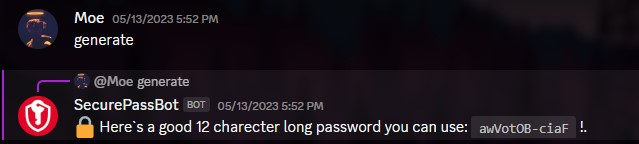
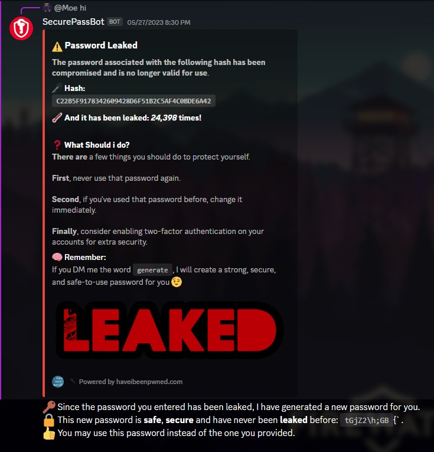
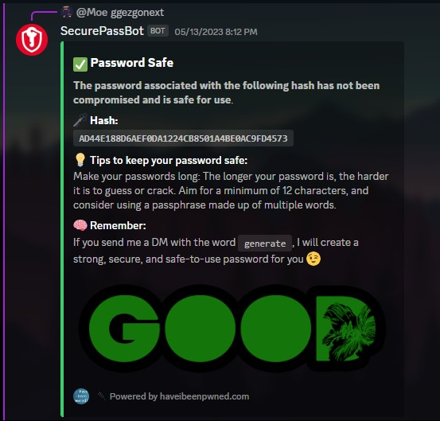

# SecurePassBot By @itsmoe15 !


This is a Discord bot that checks if a password has been compromised in a data breach. 

The bot uses the [Have I Been Pwned?](https://haveibeenpwned.com/) API to check if a password has been leaked, and it provides tips on creating strong and secure passwords.

## Features

- Generates a random 12-character password when prompted.
  
  
- Checks if a password has been compromised in a data breach.

 


- Provides tips on creating strong and secure passwords.

## Requirements

- Python 3.6 or higher
- `discord` library (can be installed using `pip install discord`)
- `requests` library (can be installed using `pip install requests`)

## Installation

1. Clone the repository to your local machine.
```
git clone https://github.com/itsmoe15/SecurePassBot.git
```
2. Install the required libraries.
```
pip install -r requirements.txt
```
3. Edit the `token` variable in the `.env.example` file to use your own Discord bot token. and rename it to `.env`
```
DISCORD_TOKEN=your-bot-token-goes-here
```
4. Give the bot the permission to run

```
sudo chmod +x main.py
```

5. Run the script.
```
python main.py
```

## Usage

The bot responds to DMs from users with a password to check. To check a password, send a DM to the bot with the password as the message content. The bot will check if the password has been compromisedin a data breach and respond with an appropriate message.

To generate a random password, send the message "generate" to the bot in any channel that the bot has access to. The bot will respond with a random 12-character password.

## Disclaimer

This bot is provided as-is and without warranty. The bot's creator is not responsible for any damages or losses arising from the use of this bot. Use this bot at your own risk.

## Contributing

Contributions are welcome! If you find a bug or have a suggestion for a new feature, please open an issue on the GitHub repository or submit a pull request.

## Credits

This bot was created by Moe. The bot uses the [Have I Been Pwned?](https://haveibeenpwned.com/) API as its database to check if a password has been leaked.

## License

This project is licensed under the [GNU GENERAL PUBLIC LICENSE](https://www.fsf.org).